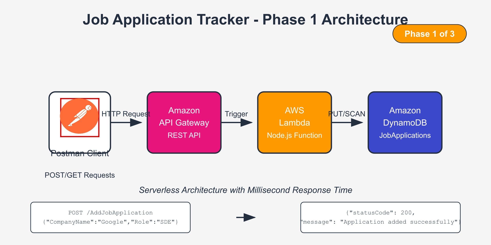
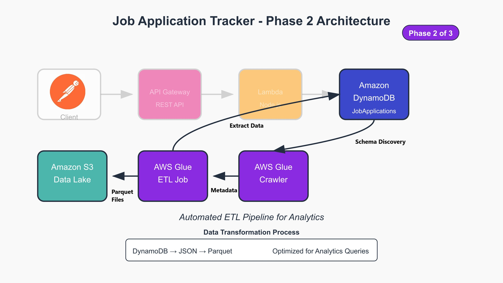
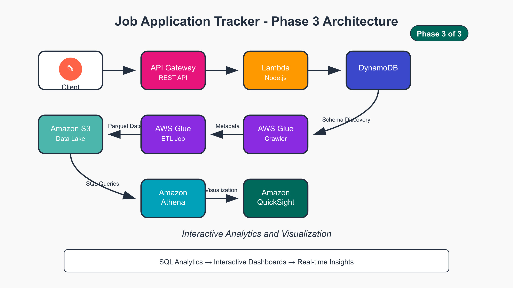
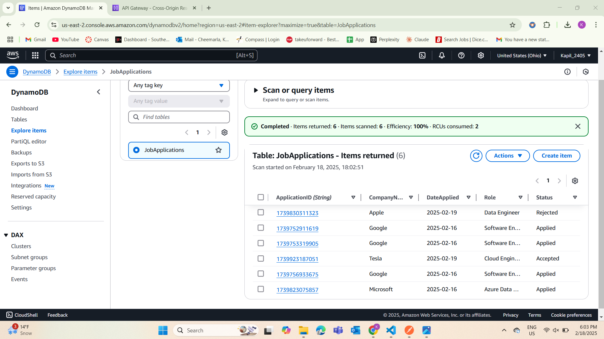
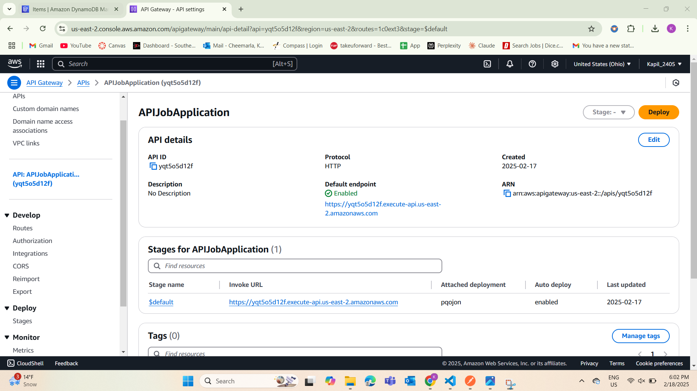
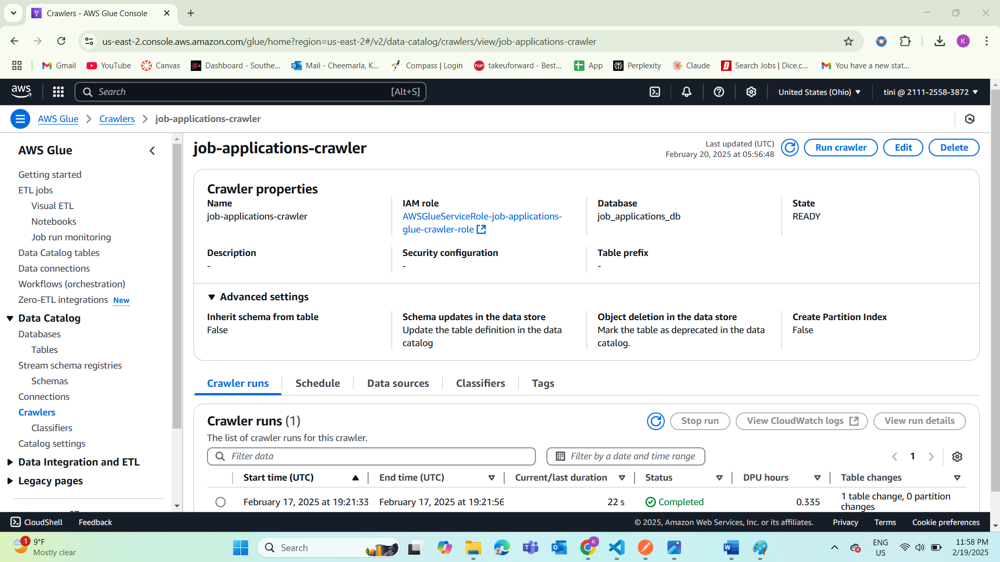
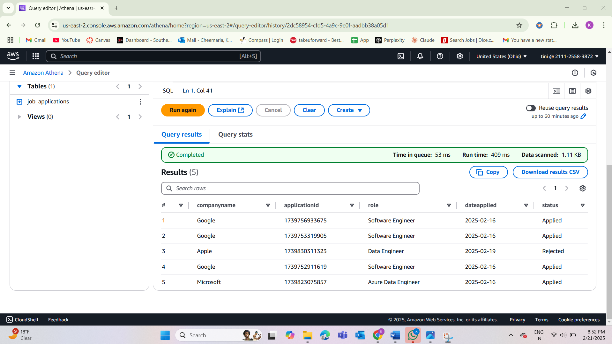
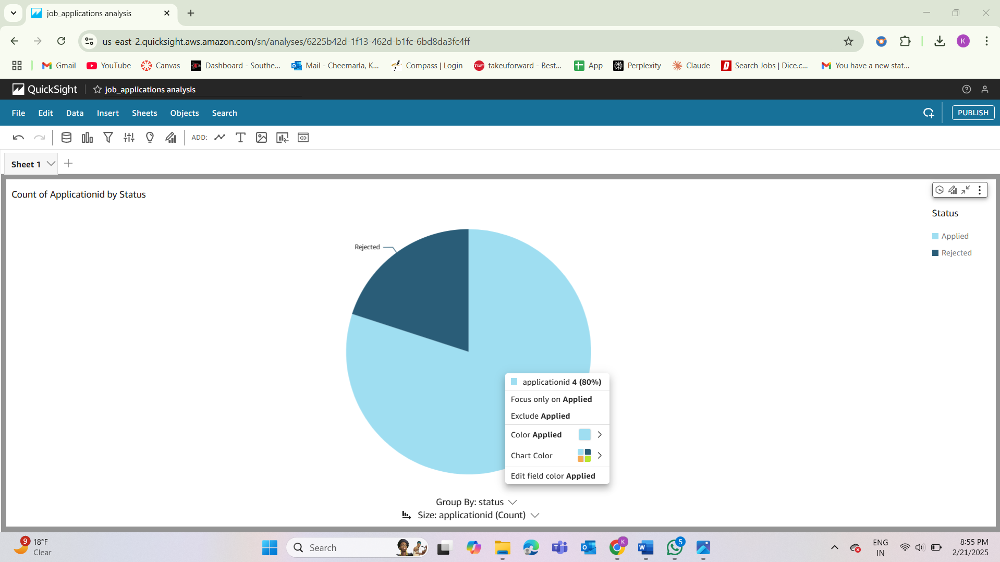

# AWS Serverless Job Application Tracker

A serverless job application tracking system with analytics capabilities built using AWS services.

## Project Overview

This project demonstrates a complete AWS cloud solution for tracking job applications with a data analytics pipeline. It allows users to:

1. Add new job applications via REST API
2. View all applications and their statuses
3. Analyze application data through SQL queries
4. Visualize application trends through interactive dashboards

## Architecture

This solution was built in three phases:

### Phase 1: Core Application


The first phase implements the serverless backend with:
- Amazon API Gateway REST API for handling HTTP requests
- AWS Lambda function (Node.js) for business logic
- Amazon DynamoDB for storing application data

### Phase 2: Data Pipeline


The second phase creates an ETL pipeline with:
- AWS Glue Crawler for schema discovery from DynamoDB
- AWS Glue ETL job for data transformation
- Amazon S3 data lake for optimized analytics storage (Parquet format)

### Phase 3: Analytics


The third phase enables data visualization with:
- Amazon Athena for SQL-based data analysis
- Amazon QuickSight for interactive dashboards

## Technologies Used

- **Amazon API Gateway**: REST API endpoints
- **AWS Lambda**: Serverless compute for handling requests
- **Amazon DynamoDB**: NoSQL database for application data
- **AWS Glue**: ETL service for data transformation
- **Amazon S3**: Object storage for the data lake
- **Amazon Athena**: SQL query service for S3 data
- **Amazon QuickSight**: Business intelligence for visualizations
- **AWS IAM**: Security and access management

## Implementation Details

### Backend API

The Lambda function handles both POST and GET requests:

```javascript
const { DynamoDBClient } = require('@aws-sdk/client-dynamodb');
const { DynamoDBDocumentClient, PutCommand, ScanCommand } = require('@aws-sdk/lib-dynamodb');

const client = new DynamoDBClient({});
const dynamoDB = DynamoDBDocumentClient.from(client);

exports.handler = async (event) => {
    try {
        // For HTTP API, method is in event.requestContext.http.method
        const httpMethod = event.requestContext?.http?.method || event.httpMethod;

        switch (httpMethod) {
            case 'POST':
                return await addJobApplication(event);
            case 'GET':
                return await getJobApplications();
            default:
                return {
                    statusCode: 400,
                    headers: {
                        "Access-Control-Allow-Origin": "",
                        "Access-Control-Allow-Headers": "Content-Type",
                        "Access-Control-Allow-Methods": "GET,POST"
                    },
                    body: JSON.stringify({ error: 'Unsupported HTTP method' })
                };
        }
    } catch (error) {
        console.error(error);
        return {
            statusCode: 500,
            headers: {
                "Access-Control-Allow-Origin": "",
                "Access-Control-Allow-Headers": "Content-Type",
                "Access-Control-Allow-Methods": "GET,POST"
            },
            body: JSON.stringify({ error: 'Operation failed' })
        };
    }
};

async function addJobApplication(event) {
    const data = JSON.parse(event.body);
    const applicationID = Date.now().toString();

    const command = new PutCommand({
        TableName: 'JobApplications',
        Item: {
            ApplicationID: applicationID,
            CompanyName: data.CompanyName,
            Role: data.Role,
            DateApplied: data.DateApplied,
            Status: data.Status
        }
    });

    await dynamoDB.send(command);

    return {
        statusCode: 200,
        headers: {
            "Access-Control-Allow-Origin": "*",
            "Access-Control-Allow-Headers": "Content-Type",
            "Access-Control-Allow-Methods": "GET,POST"
        },
        body: JSON.stringify({
            message: 'Application added successfully!',
            ApplicationID: applicationID
        })
    };
}

async function getJobApplications() {
    const command = new ScanCommand({
        TableName: 'JobApplications'
    });

    const response = await dynamoDB.send(command);

    return {
        statusCode: 200,
        headers: {
            "Access-Control-Allow-Origin": "*",
            "Access-Control-Allow-Headers": "Content-Type",
            "Access-Control-Allow-Methods": "GET,POST"
        },
        body: JSON.stringify({
            message: 'Applications retrieved successfully',
            items: response.Items
        })
    };
}
```

Sample POST request:
```json
{
  "CompanyName": "Google",
  "Role": "Software Engineer",
  "DateApplied": "2025-02-16",
  "Status": "Applied"
}
```

### DynamoDB Schema

The DynamoDB table uses the following structure:
- **Primary Key**: ApplicationID (String)
- **Attributes**:
  - CompanyName (String)
  - Role (String)
  - DateApplied (String)
  - Status (String)

### ETL Pipeline

The AWS Glue ETL job script:

```python
import sys
from awsglue.transforms import *
from awsglue.utils import getResolvedOptions
from pyspark.context import SparkContext
from awsglue.context import GlueContext
from awsglue.job import Job

# Initialize the job
args = getResolvedOptions(sys.argv, ['JOB_NAME'])
sc = SparkContext()
glueContext = GlueContext(sc)
spark = glueContext.spark_session
job = Job(glueContext)
job.init(args['JOB_NAME'], args)

try:
    # Read directly from DynamoDB
    dyf = glueContext.create_dynamic_frame_from_options(
        connection_type="dynamodb",
        connection_options={
            "dynamodb.input.tableName": "JobApplications",
            "dynamodb.throughput.read.percent": "0.5",
            "dynamodb.endpoint": "https://dynamodb.us-east-2.amazonaws.com"
        }
    )

    # Convert to DataFrame
    df = dyf.toDF()

    # Write to S3
    df.write \
        .mode("overwrite") \
        .format("parquet") \
        .save("s3://job-applications-analytics/data/")
except Exception as e:
    print("Error occurred:", str(e))
    raise e
finally:
    job.commit()
```

### Analytics Queries

Sample Athena queries:
```sql
-- View all applications
SELECT * FROM job_applications;

-- Count applications by status
SELECT status, COUNT(*) as count 
FROM job_applications 
GROUP BY status;

-- Count applications by company
SELECT companyname, COUNT(*) as count 
FROM job_applications 
GROUP BY companyname 
ORDER BY count DESC;
```

## Implementation Process

This project was built entirely using the AWS Management Console. The implementation followed these steps:

1. **Created DynamoDB Table**
   - Set up "JobApplications" table with ApplicationID as the primary key

2. **Configured Lambda Function**
   - Created a new Lambda function
   - Implemented the Node.js code to handle API requests
   - Configured appropriate IAM permissions for DynamoDB access

3. **Set Up API Gateway**
   - Created a REST API
   - Configured GET and POST methods
   - Set up Lambda integration and CORS
   - Deployed the API

4. **Created AWS Glue Crawler**
   - Configured crawler to scan the DynamoDB table
   - Ran the crawler to discover schema
   - Created a database entry in the Glue Data Catalog

5. **Implemented Glue ETL Job**
   - Created a new ETL job with the provided Python script
   - Configured job to read from DynamoDB and write to S3
   - Scheduled regular job runs

6. **Set Up Athena**
   - Created queries to analyze the data in S3
   - Configured appropriate settings for query results

7. **Built QuickSight Visualizations**
   - Connected QuickSight to Athena as the data source
   - Created interactive dashboards and charts

## Screenshots

### DynamoDB Table with Job Applications


### API Gateway Configuration


### Glue Crawler Setup


### Athena Query Results


### QuickSight Dashboard


## Future Enhancements

- Add authentication using Amazon Cognito
- Create a web frontend using AWS Amplify
- Implement status change notifications using AWS SNS
- Add application status history tracking
- Expand analytics with predictive insights

## Author

Kapil Kumar Reddy Cheemarla - https://www.linkedin.com/in/kapil-kumar-reddy-cheemarla-b918b11ab/

